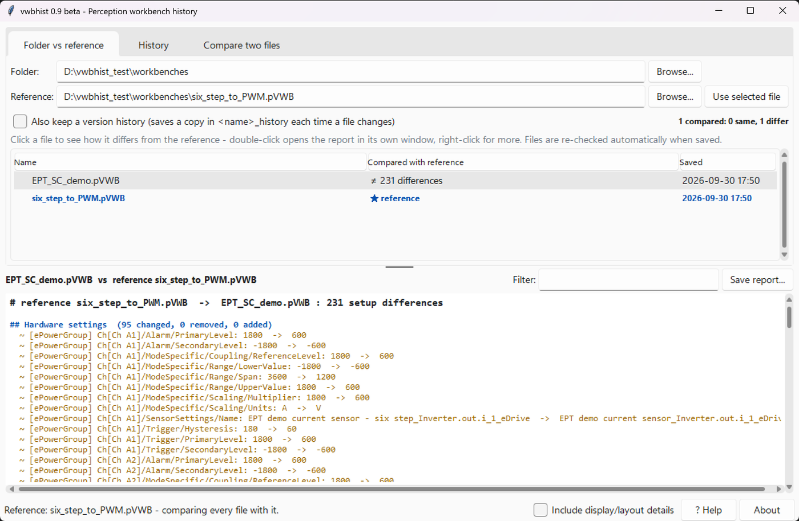

# vwbhist: Perception workbench compare & version history (beta)

> **Beta, unsupported.** Developed by Kevin Horne. This is not an official HBK product and is not supported by
> HBK. It is provided as is, without support or warranty of any kind. Check important settings in Perception
> itself before relying on a result.

vwbhist compares HBK Perception virtual workbenches (`.pVWB`) and settings files (`.pSet`) setting by setting,
and can keep a version history of them. It comes with a **GUI** (a Windows window, no typing needed) and a
command line. Only the **setup** counts: hardware settings, RT-FDB formulas, ePower/eDrive configuration, the
formula database, the info sheet and the sheet list. Window positions and recording numbers are ignored. It
only reads your workbench files and never changes them.



## Install
1. Install Python 3.8 or newer from python.org. No other packages are needed.
   Optional: `pip install sv-ttk` gives the window a Windows 11 look, light or dark to match Windows.
2. Download this repository (**Code → Download ZIP**) and copy the `vwbhist` folder somewhere, for example
   `C:\Tools\vwbhist`.

## GUI (graphical window)
Start the GUI by double-clicking `vwbhist/vwbhist_gui.bat`, or drag a folder or a `.pVWB` file onto it. From a
command prompt, `python vwbhist_gui.py` also works. It has three tabs. Hover the mouse over any
button for a hint, press **F1** for help on the current tab, and click **About** for the version and support
status.

**Folder vs reference tab.** Checks that every workbench in a folder matches a master setup.
1. Click **Browse…** and pick the folder that holds the workbenches. Sub-folders are included.
2. Select the master workbench in the tree and click **Use selected file**, or right-click it → *Set as
   reference*.
3. Every other file is marked ✓ *same as reference*, ≠ *N differences* or *cannot read*. Each sub-folder
   shows how many of its files differ.
4. Click a file to see its differences in the report below; double-click opens the report in its own window.

Leave the window open while you work: files you save from Perception are re-checked within a few seconds. The
folder and its reference are remembered for next time. Tick **Also keep a version history** to also save a
copy each time a setup changes.

**History tab.** Shows the versions of one workbench. **Snapshot now** (with an optional note) saves a
version if the setup changed. Select one version and click **Show changes** to see what changed in it, or
select two (Ctrl+click) to compare them. **Open in Perception** opens an old version, for example to roll back.

**Compare two files tab.** Compares any two workbenches, such as two test cells.

**Reports.** Each line is one setting, grouped by section: `~` changed (`old -> new`), `-` only in the first
file, `+` only in the second. Type in **Filter** (for example `Ch A1`) to narrow the report, and click
**Save report…** to write it to a text file. Tick **Include display/layout details** to also compare
displays and windows.

## Command line
```
python vwbhist.py snapshot Rig.pVWB -m "note"    save a version if the setup changed
python vwbhist.py log      Rig.pVWB              list versions: who, when, how much changed
python vwbhist.py diff     Rig.pVWB              what changed in the last save
python vwbhist.py diff     Rig.pVWB 3 7          version 3 vs version 7
python vwbhist.py diff     Rig.pVWB 5            version 5 vs the file on disk now
python vwbhist.py compare  A.pVWB B.pVWB         any two workbenches
python vwbhist.py watch    C:\Workbenches        record every save in a folder (Ctrl+C stops)
python vwbhist.py dump     Rig.pVWB              full setup as text
```
Add `-v` to include display/layout details.

## Where things are stored
Versions are kept next to each workbench:
```
Rig_history\
   history.log                    one line per version: file, time, Windows user, summary, note
   v0003_20261002_141500.pVWB     exact copy: open it in Perception to roll back
   v0003_...settings.txt          full setup as text, one "setting = value" per line
   v0003_...changes.txt           what changed vs the previous version
```
To roll back, open the `vNNNN_….pVWB` copy in Perception and save it under the working name. The window
remembers its folder and reference in `%APPDATA%\vwbhist\gui.json`.

## Optional: readable diffs in git
If your workbenches live in a git repository, git can show changed settings instead of "binary files differ":
```
.gitattributes:   *.pVWB diff=pvwb
one-time:         git config diff.pvwb.textconv "python C:/Tools/vwbhist/vwbhist.py dump"
```

## Notes
- Built and tested with Perception 8.x workbench files.
- Perception stores some settings as codes rather than units (for example `DebounceFilterTime`, `Mode` and
  `InputCoupling`), and the report shows the stored value. To learn a code, change one value in Perception,
  save, and compare.
- `EPT_TechNote_XXX_pVWB_Setup_Comparison.docx` describes the file format and the method in detail.

## Self-test
`python tests/selftest.py` runs the whole workflow on the two demo workbenches in `workbenches/` and should
report `11/11 passed`.
